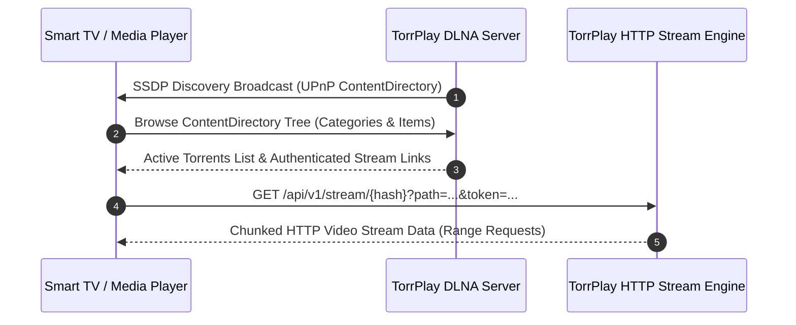

<!--
SPDX-FileCopyrightText: 2026 TorrPlay

SPDX-License-Identifier: MIT
-->

TorrPlay includes a built-in DLNA / UPnP ContentDirectory service, allowing you to discover and stream torrent media directly to Smart TVs, game consoles, media players, and set-top boxes on your local network.

## Supported Clients

The DLNA server is compatible with standard UPnP / DLNA media players, including:

- **Smart TVs:** LG webOS, Samsung Tizen, Sony Bravia, Android TV / Google TV
- **Media Players:** VLC Media Player, Kodi, Infuse
- **Consoles:** Sony PlayStation, Microsoft Xbox

## Features & Hierarchy

- **Category Browsing:** Organizes torrents into structured folders: Movies, Series, and custom categories (`category:<name>`).
- **UPnP Pagination:** Supports standard `StartingIndex` and `RequestedCount` parameters for fast, lag-free navigation across large libraries.
- **GENA Event Subscriptions:** Implements UPnP eventing (`SUBSCRIBE`, `UNSUBSCRIBE`, `NOTIFY`), notifying Smart TVs in real time when torrents are added, updated, or removed.
- **Automatic Authentication Handling:** When TorrPlay authentication is enabled, the DLNA ContentDirectory service automatically embeds scoped playback tokens into stream URLs, allowing TVs to stream media without manual login.

## Configuration

DLNA settings can be managed via the settings API (`/api/v1/settings`) or through the Web UI.

### Parameters

| Setting         | Type    | Default    | Description                                |
| --------------- | ------- | ---------- | ------------------------------------------ |
| `enable_dlna`   | boolean | `false`    | Enables or disables the DLNA / UPnP server |
| `friendly_name` | string  | `TorrPlay` | Name broadcast on the local network        |

### Enabling DLNA via API

To enable DLNA and set a custom server name:

```sh
curl -X PATCH http://localhost:8090/api/v1/settings \
  -H "Content-Type: application/json" \
  -d '{
    "enable_dlna": true,
    "friendly_name": "Living Room TorrPlay"
  }'
```

You can also toggle DLNA through the Web UI under **Settings** → **DLNA**.

## How It Works



1. When `enable_dlna` is enabled, TorrPlay announces itself on your local subnet using SSDP (Simple Service Discovery Protocol).
2. Devices on your network will show **TorrPlay** in their network media source menu.
3. Browsing the TorrPlay DLNA source presents your active torrent library formatted as video streams.
4. When a video file is selected on your TV or media player, TorrPlay streams the piece data directly over HTTP with full Range request seeking support.
