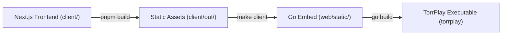

<!--
SPDX-FileCopyrightText: 2026 TorrPlay

SPDX-License-Identifier: MIT
-->

# Building from Source

This guide covers compiling TorrPlay manually from source code.

---

## Build Pipeline Overview



---

## Prerequisites

- **Go** (version 1.26 or later)
- **Make** (for static client build automation)
- **Node.js 24+ & pnpm 10+** (if building client files manually without Docker/Make)

---

## Build Steps

### 1. Clone the Repository

```sh
git clone https://github.com/torrplay/torrplay.git
cd torrplay
```

### 2. Build the Web Client Static Assets

```sh
make client
```

This compiles the Next.js frontend using Docker and copies the exported static web files into `./web/static/`.

### 3. Build the Application Binary

```sh
go build -o torrplay ./cmd/torrplay
```

This embeds the static web assets into the single Go binary `torrplay`.

---

## Running the Application

```sh
./torrplay
```

By default, TorrPlay listens on **port 8090**. Access the web UI at **http://localhost:8090**.

---

## Command Line Flags

```sh
./torrplay --help
```

```
Usage of ./torrplay:
  -data-dir string
        directory for storing configuration files (default "/home/user/.config/TorrPlay")
  -ipaddr string
        IP address to listen on (default "0.0.0.0")
  -port int
        port to listen on, overrides settings (default -1)
```

### Default Data Directory Paths

The `-data-dir` flag specifies the directory for storing configuration and database files:

| OS               | Default Path                                            |
| ---------------- | ------------------------------------------------------- |
| **Linux / Unix** | `$XDG_CONFIG_HOME/TorrPlay` or `$HOME/.config/TorrPlay` |
| **macOS**        | `$HOME/Library/Application Support/TorrPlay`            |
| **Windows**      | `%AppData%\TorrPlay`                                    |

---

## Building Docker Image Locally

```sh
make docker
```
