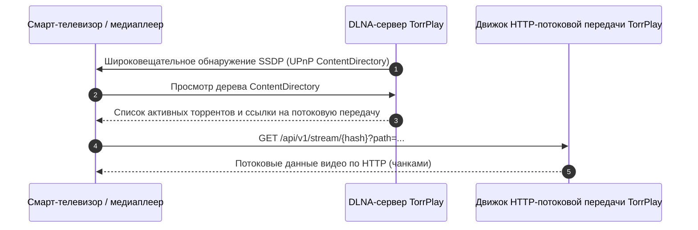

<!--
SPDX-FileCopyrightText: 2026 TorrPlay

SPDX-License-Identifier: MIT
-->

# Потоковая передача по DLNA / UPnP

TorrPlay включает встроенную службу DLNA / UPnP ContentDirectory, которая позволяет обнаруживать и воспроизводить в потоковом режиме содержимое торрентов на смарт-телевизорах, игровых консолях, медиаплеерах и телевизионных приставках в локальной сети.

## Поддерживаемые клиенты

DLNA-сервер совместим со стандартными медиаплеерами, поддерживающими протоколы UPnP / DLNA, в том числе:

- **Смарт-телевизоры:** LG webOS, Samsung Tizen, Sony Bravia, Android TV
- **Медиаплееры:** VLC Media Player, Kodi, Infuse
- **Игровые консоли:** Sony PlayStation, Microsoft Xbox

## Настройка

Параметры DLNA можно настроить через API (`/api/v1/settings`) либо через веб-интерфейс.

### Параметры

| Параметр        | Тип     | Значение по умолчанию | Описание                                     |
| --------------- | ------- | --------------------- | -------------------------------------------- |
| `enable_dlna`   | boolean | `true`                | Включение или отключение сервера DLNA / UPnP |
| `friendly_name` | string  | `TorrPlay`            | Имя сервера, вещаемое в локальной сети       |

### Включение DLNA через API

Для включения DLNA и установки имени сервера выполните следующий запрос:

```sh
curl -X PATCH http://localhost:8090/api/v1/settings \
  -H "Content-Type: application/json" \
  -d '{
    "enable_dlna": true,
    "friendly_name": "Living Room TorrPlay"
  }'
```

Включить DLNA также можно через веб-интерфейс, перейдя в раздел «Настройки» → DLNA.

## Принцип работы



1. При включённом параметре `enable_dlna` TorrPlay оповещает о своём присутствии в локальной подсети по протоколу SSDP (Simple Service Discovery Protocol).
2. Устройства в вашей сети отображают **TorrPlay** в меню источников медиаконтента.
3. При просмотре источника TorrPlay в меню DLNA отображается библиотека активных торрентов в виде видеопотоков.
4. При выборе видеофайла на телевизоре или медиаплеере TorrPlay передаёт данные частей напрямую по HTTP.
