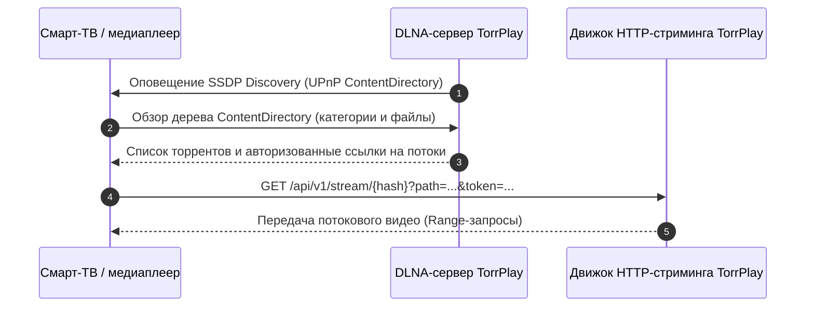

<!--
SPDX-FileCopyrightText: 2026 TorrPlay

SPDX-License-Identifier: MIT
-->

TorrPlay содержит встроенную службу DLNA / UPnP ContentDirectory, позволяющую находить и воспроизводить медиафайлы из торрентов на смарт-телевизорах, игровых приставках, медиаплеерах и ТВ-приставках в локальной сети.

## Поддерживаемые устройства

Сервер DLNA совместим со стандартными медиаплеерами UPnP / DLNA, включая:

- **Смарт-ТВ:** LG webOS, Samsung Tizen, Sony Bravia, Android TV / Google TV
- **Медиаплееры:** VLC Media Player, Kodi, Infuse
- **Игровые консоли:** Sony PlayStation, Microsoft Xbox

## Возможности и структура каталогов

- **Навигация по категориям:** структурирование раздач по папкам: «Фильмы», «Сериалы» и пользовательские категории (`category:<name>`).
- **Пагинация UPnP:** поддержка стандартных параметров `StartingIndex` и `RequestedCount` для быстрой навигации даже в больших библиотеках.
- **Подписка на события GENA:** поддержка оповещений UPnP (`SUBSCRIBE`, `UNSUBSCRIBE`, `NOTIFY`) мгновенно обновляет список файлов на экране ТВ при изменениях в библиотеке.
- **Автоматическая авторизация:** если в TorrPlay включена аутентификация, служба DLNA сама подставляет токены воспроизведения в ссылки на видео, поэтому на телевизоре ничего вводить вручную не нужно.

## Настройка

Параметры DLNA настраиваются через API (`/api/v1/settings`) или в веб-интерфейсе.

### Параметры

| Параметр        | Тип     | По умолчанию | Описание                                     |
| --------------- | ------- | ------------ | -------------------------------------------- |
| `enable_dlna`   | boolean | `false`      | Включение или отключение сервера DLNA / UPnP |
| `friendly_name` | string  | `TorrPlay`   | Имя сервера, транслируемое в локальной сети  |

### Включение DLNA через API

Чтобы включить DLNA и задать понятное имя устройства:

```sh
curl -X PATCH http://localhost:8090/api/v1/settings \
  -H "Content-Type: application/json" \
  -d '{
    "enable_dlna": true,
    "friendly_name": "Living Room TorrPlay"
  }'
```

Также DLNA можно включить в веб-интерфейсе в разделе **Настройки** → **DLNA**.

## Как это работает



1. При включённом `enable_dlna` TorrPlay анонсирует себя в локальной подсети по протоколу SSDP.
2. Сетевые устройства обнаружат источник **TorrPlay** в меню медиаисточников.
3. При открытии источника отображается библиотека активных торрентов с возможностью выбора файлов.
4. При выборе видеофайла телевизор запрашивает данные у встроенного HTTP-сервера с полной поддержкой перемотки через Range-запросы.
