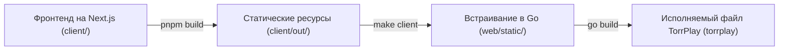

<!--
SPDX-FileCopyrightText: 2026 TorrPlay

SPDX-License-Identifier: MIT
-->

# Сборка из исходного кода

Данное руководство описывает ручную компиляцию TorrPlay из исходного кода.

---

## Обзор процесса сборки



---

## Предварительные требования

- **Go** (версия 1.26 или более поздняя)
- **Make** (для автоматизации сборки статических файлов клиента)
- **Node.js 24+ и pnpm 10+** (при ручной сборке файлов клиента без использования Docker/Make)

---

## Этапы сборки

### 1. Клонирование репозитория

```sh
git clone https://github.com/torrplay/torrplay.git
cd torrplay
```

### 2. Сборка статических ресурсов веб-клиента

```sh
make client
```

Данная команда компилирует фронтенд на Next.js с помощью Docker и копирует экспортированные статические файлы веб-интерфейса в директорию `./web/static/`.

### 3. Сборка исполняемого файла приложения

```sh
go build -o torrplay ./cmd/torrplay
```

Данная команда встраивает статические ресурсы веб-интерфейса в единый исполняемый файл Go — `torrplay`.

---

## Запуск приложения

```sh
./torrplay
```

По умолчанию TorrPlay использует **порт 8090**. Веб-интерфейс доступен по адресу **http://localhost:8090**.

---

## Параметры командной строки

```sh
./torrplay --help
```

```
Usage of ./torrplay:
  -data-dir string
        directory for storing configuration files (default "/home/user/.config/TorrPlay")
  -ipaddr string
        IP address to listen on (default "0.0.0.0")
  -port int
        port to listen on, overrides settings (default -1)
```

### Пути к директории данных по умолчанию

Параметр `-data-dir` определяет директорию для хранения файлов конфигурации:

| ОС               | Путь по умолчанию                                         |
| ---------------- | --------------------------------------------------------- |
| **Linux / Unix** | `$XDG_CONFIG_HOME/TorrPlay` либо `$HOME/.config/TorrPlay` |
| **macOS**        | `$HOME/Library/Application Support/TorrPlay`              |
| **Windows**      | `%AppData%\TorrPlay`                                      |

---

## Локальная сборка образа Docker

```sh
make docker
```
